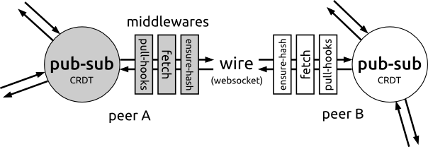

# kabel

<p align="center">
<a href="https://clojurians.slack.com/archives/CB7GJAN0L"></a>
<a href="https://clojars.org/org.replikativ/kabel"></a>
<a href="https://circleci.com/gh/replikativ/kabel"></a>
<a href="https://github.com/replikativ/kabel/tree/main"></a>
<a href="https://cljdoc.org/d/org.replikativ/kabel"></a>
</p>

**kabel** (German for "cable/wire") is a minimal, modern connection library for building peer-to-peer applications in Clojure and ClojureScript. It models a bidirectional wire to pass Clojure values between symmetric peers over WebSockets.

## Features

- **Cross-platform**: Works on JVM, browser, Node.js, and React-Native
- **Symmetric peers**: Server and client use identical patterns, enabling true P2P architectures
- **Pluggable serialization**: Transit, Fressian, JSON, or EDN out of the box
- **Topic-based pub/sub**: Built-in publish/subscribe with backpressure and flow control
- **Composable middleware**: Filter, transform, and route messages through stackable middleware
- **Erlang-style supervision**: Exception handling via [superv.async](https://github.com/replikativ/superv.async)
- **Optional authentication**: Trusted-issuer JWT (cross-platform HS256, JWKS-backed RS256 for WorkOS/Clerk/OIDC) on the handshake, behind the `:auth` alias — see [Authentication](#authentication-optional)

## Used By

kabel provides the network layer for several replikativ projects:

- **[datahike](https://github.com/replikativ/datahike)** - Durable Datalog database powered by an efficient query engine
- **[replikativ](https://github.com/replikativ/replikativ)** - CRDT-based peer-to-peer data replication system
- **[konserve-sync](https://github.com/replikativ/konserve-sync)** - Real-time synchronization layer for konserve key-value stores
- **[kabel-auth](https://github.com/replikativ/kabel-auth)** - Authentication middleware with JWT and OAuth support

## Installation

Add to your dependencies:

[](http://clojars.org/org.replikativ/kabel)

```clojure
;; deps.edn
{:deps {org.replikativ/kabel {:mvn/version "LATEST"}}}
```

## Quick Start

```clojure
(ns my-app.core
  (:require [kabel.peer :as peer]
            [kabel.http-kit :as http-kit]
            [superv.async :refer [<?? go-try go-loop-try <? >? S]]
            [clojure.core.async :refer [chan]]))

;; Server: echo messages back to client
(def server-id #uuid "05a06e85-e7ca-4213-9fe5-04ae511e50a0")
(def url "ws://localhost:8080")

(defn echo-middleware [[S peer [in out]]]
  (go-loop-try S [msg (<? S in)]
    (when msg
      (>? S out msg)
      (recur (<? S in))))
  [S peer [(chan) (chan)]])

(def server
  (peer/server-peer S
    (http-kit/create-http-kit-handler! S url server-id)
    server-id
    echo-middleware
    identity)) ;; or use transit/fressian middleware

(<?? S (peer/start server))

;; Client: send messages and receive responses
(def client-id #uuid "c14c628b-b151-4967-ae0a-7c83e5622d0f")

(def client
  (peer/client-peer S client-id
    (fn [[S peer [in out]]]
      (go-try S
        (>? S out {:msg "Hello, kabel!"})
        (println "Response:" (<? S in)))
      [S peer [(chan) (chan)]])
    identity))

(<?? S (peer/connect S client url))
```

## Pub/Sub

kabel includes a topic-based publish/subscribe system with built-in backpressure for initial synchronization.

### Server Setup

```clojure
(ns my-app.server
  (:require [kabel.peer :as peer]
            [kabel.http-kit :as http-kit]
            [kabel.pubsub :as pubsub]
            [kabel.pubsub.protocol :as proto]
            [superv.async :refer [S <??]]))

;; Create pubsub context
(def ctx (pubsub/make-context S {:batch-size 10
                                  :batch-timeout-ms 30000}))

;; Register a topic with a sync strategy
(pubsub/register-topic! ctx :notifications
  (proto/pub-sub-only-strategy
    (fn [payload] (println "Received:" payload))))

;; Create server with pubsub middleware
(def server
  (peer/server-peer S
    (http-kit/create-http-kit-handler! S "ws://localhost:8080" :server-id)
    :server-id
    (pubsub/pubsub-middleware ctx)
    identity))

(<?? S (peer/start server))

;; Publish to all subscribers
(<?? S (pubsub/publish! ctx :notifications {:event "user-joined" :user "alice"}))
```

### Client Setup

```clojure
(ns my-app.client
  (:require [kabel.peer :as peer]
            [kabel.pubsub :as pubsub]
            [kabel.pubsub.protocol :as proto]
            [superv.async :refer [S <??]]))

;; Create client pubsub context
(def ctx (pubsub/make-context S {}))

;; Define what happens when we receive publishes
(def strategy
  (proto/pub-sub-only-strategy
    (fn [payload]
      (println "Notification:" payload))))

;; Create client with pubsub middleware
(def client
  (peer/client-peer S :client-id
    (pubsub/pubsub-middleware ctx)
    identity))

(<?? S (peer/connect S client "ws://localhost:8080"))

;; Subscribe to topic
(<?? S (pubsub/subscribe! ctx [:notifications] {:notifications strategy}))
```

### Custom Sync Strategies

For scenarios requiring initial state synchronization (e.g., syncing a database), implement the `PSyncStrategy` protocol:

```clojure
(defrecord MySyncStrategy [store]
  proto/PSyncStrategy

  (-init-client-state [_]
    ;; Return channel with client's current state
    (go {:last-sync-time (get-last-sync store)}))

  (-handshake-items [_ client-state]
    ;; Return channel yielding items newer than client's state
    (get-items-since store (:last-sync-time client-state)))

  (-apply-handshake-item [_ item]
    ;; Apply received item to local store
    (go (save-item! store item) {:ok true}))

  (-apply-publish [_ payload]
    ;; Handle incremental publish
    (go (save-item! store payload) {:ok true})))
```

## Middlewares

Middlewares are composable functions that transform the `[S peer [in out]]` channel tuple. They can filter, transform, serialize, or route messages.

### Serialization Middlewares

| Middleware | Description |
|------------|-------------|
| `kabel.middleware.transit/transit` | Efficient binary (JSON/MessagePack) with custom type support |
| `kabel.middleware.fressian/fressian` | Clojure-optimized binary format |
| `kabel.middleware.json/json` | Plain JSON for non-Clojure interop |
| `identity` | EDN via pr-str/read-string (default) |

```clojure
(require '[kabel.middleware.transit :refer [transit]])

(def server
  (peer/server-peer S handler server-id
    my-middleware
    transit)) ;; Use transit serialization
```

### Utility Middlewares

- **Block Detector** (`kabel.middleware.block-detector`): Warns when channels are blocked > 5 seconds
- **Handler** (`kabel.middleware.handler`): Generic callback middleware for custom transforms
- **WAMP** (`kabel.middleware.wamp`): Experimental WAMP protocol client

## Authentication (optional)

kabel ships an optional authentication subsystem under `kabel.auth.*`, kept
behind the `:auth` alias so the **base library pulls no JSON/JWT/crypto
dependencies**. It provides trusted-issuer JWT validation on the WebSocket
handshake, cross-platform (JVM + browser + Node) HS256, JWKS-backed RS256 for
external identity providers (WorkOS, Clerk, Auth0, …), password hashing, reitit
auth routes, and a pluggable identity/session store.

> This was previously the separate `kabel-auth` library; it has been folded into
> kabel so the transport and its auth layer version and release together. The
> namespaces moved `kabel-auth.* → kabel.auth.*`. The old
> [kabel-auth](https://github.com/replikativ/kabel-auth) repo is deprecated.

Add the auth dependencies (mirrors kabel's `:auth` alias — only needed if you use auth):

```clojure
;; deps.edn
{:aliases {:auth {:extra-deps {metosin/jsonista    {:mvn/version "1.0.0"}
                               buddy/buddy-hashers  {:mvn/version "2.0.167"}
                               org.replikativ/geheimnis {:mvn/version "0.2.33"}}}}}
```

### Validate tokens on the WebSocket handshake

```clojure
(require '[kabel.auth.jwt :as jwt]
         '[kabel.auth.http-kit :as auth-hk]
         '[superv.async :refer [S]])

;; A validator is (fn [ring-req] -> principal-map | nil).
(def validate! (jwt/build-bearer-validator {:alg :HS256 :secret "your-secret"}))

(def handler
  (auth-hk/create-authenticated-http-kit-handler! S url peer-id validate!))
```

Authenticated messages carry `:kabel/principal` (the JWT claims). HS256 signing
(`jwt/sign-hs256`) and verification work identically on the JVM and in
ClojureScript (browser/Node), so a CLJS peer can both mint and verify tokens.
RS256 verification is JVM-only.

### Trusted-issuer registry + external providers (JWKS)

Register multiple issuers keyed by the token `iss`; the alg is **pinned per
issuer** (never taken from the token header — this defeats `alg:none` and
RS256→HS256 downgrades). A JWKS resolver fetches and caches an issuer's rotating
public keys — the WorkOS / Clerk / OIDC path, out of the box:

```clojure
(require '[kabel.auth.jwks :as jwks])

(def validate!
  (jwt/build-bearer-validator
   {:issuers {"simmis" {:alg :HS256 :secret secret}
              "https://api.workos.com/user_management/CLIENT_ID"
              {:alg :RS256 :jwks-url "https://api.workos.com/sso/jwks/CLIENT_ID"}}
    :key-resolver (jwks/make-key-resolver)}))     ; per-url cache, refetch on kid miss
```

### Identity / session store

`kabel.auth.store.protocol/AuthStore` abstracts party + session storage. A
portable in-memory store ships for tests and lightweight peers
(`kabel.auth.store.memory`, `.cljc` — JVM, Node and browser); a datahike-backed
store ships for the JVM (`kabel.auth.store.datahike`, needs the consumer's
datahike). Password hashing (`kabel.auth.password`, buddy-hashers) and reitit
auth routes (`kabel.auth.routes`: login / register / refresh) complete a
server-side credential flow. Auth tests run with `clojure -X:auth:test`.

## Rationale

WebSockets provide several benefits over REST for peer-to-peer applications:

- **Bidirectional**: Both peers can push messages, eliminating the client/server distinction
- **Symmetric**: One input channel, one output channel - simple semantics
- **Efficient**: Single persistent connection vs. repeated HTTP handshakes

While WebSocket is the primary transport, kabel's architecture supports pluggable transports. Future versions may include WebRTC for true P2P (no relay server), WebTransport (HTTP/3), Server-Sent Events, or raw TCP/UDP sockets.

The tradeoff is that REST is more standardized and offers better interoperability for non-Clojure clients.

## Design



Each connection has a pair of channels, but at the core the peer uses a pub-sub architecture. You can pass messages to other clients through this pub-sub core or subscribe to specific message types:

```clojure
(let [[bus-in bus-out] (get-in @peer [:volatile :chans])
      b-chan (chan)]
  (async/sub bus-out :broadcast b-chan)
  (async/put! bus-in {:type :broadcast :hello :everybody})
  (<!! b-chan))
```

## Build

The project uses deps.edn and tools.build for Clojure, and shadow-cljs for ClojureScript.

```bash
# Compile Java helper classes
clj -T:build compile-java

# Install npm dependencies (for ClojureScript)
npm install

# Run the pingpong example
clj -M:pingpong

# Check code formatting
clj -M:format

# Auto-fix formatting
clj -M:ffix
```

## Testing

```bash
# JVM tests
clj -X:test

# ClojureScript (Node.js)
npx shadow-cljs compile node-test && node target/node-tests.js

# ClojureScript (Browser)
npx shadow-cljs watch test
# Open http://localhost:8022

# Integration tests (JVM server + Node.js client)
./test-integration.sh
```

## Connectivity

Currently kabel supports WebSockets via:
- **Server**: [http-kit](https://github.com/http-kit/http-kit)
- **JVM Client**: [Tyrus](https://projects.eclipse.org/projects/ee4j.tyrus) (chosen for GraalVM native compilation support)
- **JS Client**: Native WebSocket API / w3c-websocket (Node.js)

## TODO

### Transport Alternatives
- Investigate [Jetty](https://eclipse.dev/jetty/) or other server stacks as alternatives to http-kit
- WebRTC data channels for true peer-to-peer without relay servers
- [WebTransport](https://web.dev/webtransport/) (HTTP/3-based, multiple streams)
- Server-Sent Events + HTTP POST for firewall-friendly scenarios
- Raw TCP/UDP sockets for server-to-server and IoT

### Protocol Improvements
- Configuration handshake to auto-negotiate serialization format between peers
- Investigate [libp2p GossipSub](https://github.com/libp2p/go-libp2p-pubsub) for decentralized mesh networking
- Explore gossip protocols for P2P peer discovery and message propagation

### Other
- Factor out platform-neutral logging
- Implement Node.js WebSocket server
- Expand WAMP client protocol support

## Contributors

- Konrad Kühne
- Sang-Kyu Park
- Brian Marco
- Christian Weilbach

## License

Copyright © 2015-2025 Christian Weilbach, 2015 Konrad Kühne

Distributed under the Eclipse Public License either version 1.0 or (at your option) any later version.
