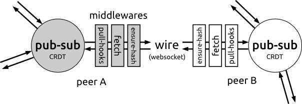

# kabel

<p align="center">
<a href="https://clojurians.slack.com/archives/CB7GJAN0L"></a>
<a href="https://clojars.org/org.replikativ/kabel"></a>
<a href="https://circleci.com/gh/replikativ/kabel"></a>
<a href="https://github.com/replikativ/kabel/tree/main"></a>
<a href="https://cljdoc.org/d/org.replikativ/kabel"></a>
</p>

**kabel** (German for "cable/wire") is a minimal, modern connection library for building peer-to-peer applications in Clojure and ClojureScript. It models a bidirectional wire to pass Clojure values between symmetric peers over WebSockets.

## Features

- **Cross-platform**: Works on JVM, browser, Node.js, and React-Native
- **Language-neutral carrier**: A documented four-byte framing profile and a
  small Python CBOR/WebSocket package
- **Symmetric peers**: Server and client use identical patterns, enabling true P2P architectures
- **Pluggable serialization**: CBOR, Transit, Fressian, JSON, or EDN out of the box
- **Pluggable server**: http-kit by default or Jetty 12, behind one Ring-based
  interface — see [Server adapters](#server-adapters)
- **Topic-based pub/sub**: Built-in publish/subscribe with backpressure and flow control
- **Composable middleware**: Filter, transform, and route messages through stackable middleware
- **Erlang-style supervision**: Exception handling via [superv.async](https://github.com/replikativ/superv.async)
- **Optional authentication**: Trusted-issuer JWT (cross-platform HS256, JWKS-backed RS256 for WorkOS/Clerk/OIDC) on the handshake, behind the `:auth` alias — see [Authentication](#authentication-optional)

## Used By

kabel provides the network layer for several replikativ projects:

- **[datahike](https://github.com/replikativ/datahike)** - Durable Datalog database powered by an efficient query engine
- **[replikativ](https://github.com/replikativ/replikativ)** - CRDT-based peer-to-peer data replication system
- **[konserve-sync](https://github.com/replikativ/konserve-sync)** - Real-time synchronization layer for konserve key-value stores
- **[kabel-auth](https://github.com/replikativ/kabel-auth)** - Authentication middleware with JWT and OAuth support

## Installation

Add to your dependencies:

[](http://clojars.org/org.replikativ/kabel)

```clojure
;; deps.edn
{:deps {org.replikativ/kabel {:mvn/version "LATEST"}}}
```

Kabel uses the maintained `org.replikativ/http-kit` distribution. It preserves
http-kit's `org.httpkit.*` namespaces and public API while adding the transport
limits described below. Do not also add `http-kit/http-kit`: both coordinates
contain the same namespaces and classes. If a transitive dependency brings the
upstream coordinate, exclude it at that dependency.

## Quick Start

```clojure
(ns my-app.core
  (:require [kabel.peer :as peer]
            [kabel.http-kit :as http-kit]
            [superv.async :refer [<?? go-try go-loop-try <? >? S]]
            [clojure.core.async :refer [chan]]))

;; Server: echo messages back to client
(def server-id #uuid "05a06e85-e7ca-4213-9fe5-04ae511e50a0")
(def url "ws://localhost:8080")

(defn echo-middleware [[S peer [in out]]]
  (go-loop-try S [msg (<? S in)]
    (when msg
      (>? S out msg)
      (recur (<? S in))))
  [S peer [(chan) (chan)]])

(def server
  (peer/server-peer S
    (http-kit/create-http-kit-handler! S url server-id)
    server-id
    echo-middleware
    identity)) ;; or use transit/fressian middleware

(<?? S (peer/start server))

;; Client: send messages and receive responses
(def client-id #uuid "c14c628b-b151-4967-ae0a-7c83e5622d0f")

(def client
  (peer/client-peer S client-id
    (fn [[S peer [in out]]]
      (go-try S
        (>? S out {:msg "Hello, kabel!"})
        (println "Response:" (<? S in)))
      [S peer [(chan) (chan)]])
    identity))

(<?? S (peer/connect S client url))
```

## Reconnection

`peer/connect` makes one connection and yields a channel that closes when it
does. `peer/maintain` keeps a client connected: it reconnects with exponential
backoff when the connection drops or an attempt fails, and reports every
transition on the peer's bus as `{:type :kabel.peer/status :status ...}` and to
an `:on-status` callback.

```clojure
(def link
  (peer/maintain S client url
    {:on-status (fn [{:keys [status attempt error]}]
                  (println status attempt error))
     :backoff {:initial-ms 500 :max-ms 30000 :factor 2 :jitter 0.2}}))

;; statuses: :connecting :connected :disconnected :failed :authenticated :stopped
((:stop! link))
```

Every reconnection runs the peer's middleware stack again, so the layers above
see it exactly as they saw the first connection: the auth middleware
authenticates with a freshly read token, `kabel.remote` announces the peer
again, and pub/sub subscriptions have to be made again. `peer/disconnect!`
closes the current connection; under `maintain` that is a reconnect, after
`:stop!` it is the end.

## Pub/Sub

kabel includes a topic-based publish/subscribe system with built-in backpressure for initial synchronization.

### Server Setup

```clojure
(ns my-app.server
  (:require [kabel.peer :as peer]
            [kabel.http-kit :as http-kit]
            [kabel.pubsub :as pubsub]
            [kabel.pubsub.protocol :as proto]
            [superv.async :refer [S <??]]))

;; Create pubsub context
(def ctx (pubsub/make-context S {:batch-size 10
                                  :batch-timeout-ms 30000}))

;; Register a topic with a sync strategy
(pubsub/register-topic! ctx :notifications
  (proto/pub-sub-only-strategy
    (fn [payload] (println "Received:" payload))))

;; Create server with pubsub middleware
(def server
  (peer/server-peer S
    (http-kit/create-http-kit-handler! S "ws://localhost:8080" :server-id)
    :server-id
    (pubsub/pubsub-middleware ctx)
    identity))

(<?? S (peer/start server))

;; Publish to all subscribers
(<?? S (pubsub/publish! ctx :notifications {:event "user-joined" :user "alice"}))
```

### Client Setup

```clojure
(ns my-app.client
  (:require [kabel.peer :as peer]
            [kabel.pubsub :as pubsub]
            [kabel.pubsub.protocol :as proto]
            [superv.async :refer [S <??]]))

;; Create client pubsub context
(def ctx (pubsub/make-context S {}))

;; Define what happens when we receive publishes
(def strategy
  (proto/pub-sub-only-strategy
    (fn [payload]
      (println "Notification:" payload))))

;; Create client with pubsub middleware
(def client
  (peer/client-peer S :client-id
    (pubsub/pubsub-middleware ctx)
    identity))

(<?? S (peer/connect S client "ws://localhost:8080"))

;; Subscribe to topic
(<?? S (pubsub/subscribe! ctx [:notifications] {:notifications strategy}))
```

### Custom Sync Strategies

For scenarios requiring initial state synchronization (e.g., syncing a database), implement the `PSyncStrategy` protocol:

```clojure
(defrecord MySyncStrategy [store]
  proto/PSyncStrategy

  (-init-client-state [_]
    ;; Return channel with client's current state
    (go {:last-sync-time (get-last-sync store)}))

  (-handshake-items [_ client-state]
    ;; Return channel yielding items newer than client's state
    (get-items-since store (:last-sync-time client-state)))

  (-apply-handshake-item [_ item]
    ;; Apply received item to local store
    (go (save-item! store item) {:ok true}))

  (-apply-publish [_ payload]
    ;; Handle incremental publish
    (go (save-item! store payload) {:ok true})))
```

## Remote invocation

`kabel.remote` lets a peer serve named functions and a connected peer call
them with an argument map. It is the runtime `distributed-scope`'s
`defn-go-remote` macros are built on, moved here so the protocol has one home
and reconnection, authentication and authorization apply to it. The frames
are specified in [doc/remote-invocation.md](doc/remote-invocation.md).

```clojure
(require '[kabel.remote :as remote])

;; both peers compose the middleware, inside the codec
(def server (peer/server-peer S handler server-id (comp app-middleware remote/middleware) cbor))
(def client (peer/client-peer S client-id (comp app-middleware remote/middleware) cbor))

;; the serving side registers functions and serves, behind a gate
(remote/register! 'my.app/add (fn [{:keys [a b]}] (+ a b)))
(remote/serve server {:authorize (fn [{:keys [op principal fn-name arg-map]}]
                                   (some? principal))})

;; the calling side
(go-try S
  (<? S (remote/connect S client url))                            ;; => server-id
  (<? S (remote/invoke client server-id 'my.app/add {:a 1 :b 2}))) ;; => 3
```

A function returns a value or a channel yielding one. It receives the
connection's principal under `:kabel/principal` when the connection is
authenticated. Errors arrive typed: `:kabel.remote/unknown-function`,
`:kabel.remote/not-authorized`, `:kabel.remote/authentication-required`, or the
`:type` of the exception the function threw. A call issued before the
connection exists waits for it; one in flight when the connection closes fails
with `:kabel.remote/disconnected`, and `:timeout-ms` bounds either wait.

## Middlewares

Middlewares are composable functions that transform the `[S peer [in out]]` channel tuple. They can filter, transform, serialize, or route messages.

### Serialization Middlewares

| Middleware | id | Description |
|------------|---:|-------------|
| `kabel.middleware.cbor/cbor` | 14 | [boring][] — RFC 8949 CBOR. Fast, JVM **and** ClojureScript, and readable by any language |
| `kabel.middleware.transit/transit` | | Efficient binary (JSON/MessagePack) with custom type support |
| `kabel.middleware.fressian/fressian` | | Clojure-optimized binary format, JVM only |
| `kabel.middleware.json/json` | | Plain JSON for non-Clojure interop |
| `identity` | | EDN via pr-str/read-string (default) |

```clojure
(require '[kabel.middleware.cbor :refer [cbor]])

(def server
  (peer/server-peer S handler server-id
    my-middleware
    cbor)) ;; RFC 8949 CBOR on the wire
```

**stringref is off by default here**, unlike boring's own default. Tags 25/256
are a schmorp extension that most CBOR libraries do not implement, so leaving
it on would make every frame unreadable to exactly the non-Clojure peers the
format exists to reach. It buys almost nothing on this wire anyway once
permessage-deflate is in play — on one 500-message capture, 95 624 raw bytes
became 10 816 deflated with stringref on and 10 787 with it off, a 0.3%
difference, because deflate finds the same repetition stringref does.

### Migrating an existing fressian deployment

A frame's leading 4 bytes are the serialization id, so a peer that receives an
id it does not know cannot decode the frame. Switching every peer at once is
not usually possible, so `kabel.middleware.dual` makes it two deploys:

1. deploy every peer on `dual-read-fressian-write` — it *understands* CBOR
   while still writing fressian, so old peers keep working;
2. once no peer predates step 1, switch writers to `dual-read-cbor-write`.

[boring]: https://github.com/replikativ/boring

### Python and other runtimes

[`WIRE.md`](WIRE.md) specifies the stable binary carrier independently of
Clojure. The Python reference package lives in `interop/python`:

```sh
python3 -m pip install ./interop/python
python3 -m pip install './interop/python[websocket]'  # optional asyncio client
```

```python
from kabel_protocol import encode_cbor_frame, decode_cbor_frame

frame = encode_cbor_frame({"type": "ping", "n": 7})
assert decode_cbor_frame(frame) == {"type": "ping", "n": 7}
```

This is intentionally a carrier API, not a Python transcription of Clojure
protocol objects. Netz and other application protocols define portable pub/sub
and synchronization semantics above it.

### Utility Middlewares

- **Block Detector** (`kabel.middleware.block-detector`): Warns when channels are blocked > 5 seconds
- **Handler** (`kabel.middleware.handler`): Generic callback middleware for custom transforms
- **WAMP** (`kabel.middleware.wamp`): Experimental WAMP protocol client

### Connection transport middleware

Peers have an optional middleware boundary outside serialization. It is meant
for connection protocols such as Noise that must authenticate and protect the
encoded frames before application middleware can observe them:

```clojure
(:require [kabel.transport :as transport])

(defn authenticated-transport [remote-authority]
  (fn [connection]
    ;; A real implementation performs its handshake before forwarding frames.
    (transport/update!
      connection
      {::transport/authenticated-authority remote-authority
       ::transport/negotiated-capabilities #{:netz/v1}})
    connection))

(peer/client-peer S client-id app-middleware cbor/cbor
                  (atom {}) (atom {})
                  {:transport-middleware
                   (authenticated-transport remote-authority)
                   :connection-context
                   {::transport/expected-target expected-authority}})
```

Inbound order is socket, transport, serialization, application; outbound order
is the reverse. Existing middleware still accepts and returns exactly
`[S peer [in out]]`. `kabel.transport/connection-context` obtains the
connection-local context atom, and Kabel preserves it even when legacy
middleware returns fresh channels without metadata. Contexts have unique ids,
initiator/responder roles and lifecycle entries in
`(kabel.transport/connections peer)`; authentication middleware owns the
authenticated remote and negotiated capability values.

### Transport metrics

`kabel.metrics` records into the shared `replikativ.metrics` registry without
choosing an exposition format. Compose `messages` with the application
middleware, inside the codec, and `wire` outside the codec:

```clojure
(:require [kabel.metrics :as metrics]
          [kabel.middleware.cbor :as cbor]
          [kabel.pubsub :as pubsub])

(peer/server-peer S handler server-id
  (comp (pubsub/make-pubsub-peer-middleware opts) metrics/messages)
  (comp cbor/cbor metrics/wire))
```

This records logical messages by direction and `:type`, application bytes by
direction and serialization, connection/reconnection/disconnection events,
and successful pub/sub subscription events. Wire bytes are measured before a
WebSocket extension such as permessage-deflate; they are the application-byte
load, not a packet capture. Peer ids, URLs, and topics are deliberately absent
from labels to keep metric cardinality bounded. A host can render the registry
with `replikativ.metrics.prometheus` or consume its plain snapshot directly.

## Authentication (optional)

kabel ships an optional authentication subsystem under `kabel.auth.*`, kept
behind the `:auth` alias so the **base library pulls no JSON/JWT/crypto
dependencies**. It provides trusted-issuer JWT validation on the WebSocket
handshake, cross-platform (JVM + browser + Node) HS256, JWKS-backed RS256 for
external identity providers (WorkOS, Clerk, Auth0, …), password hashing, reitit
auth routes, and a pluggable identity/session store.

> This was previously the separate `kabel-auth` library; it has been folded into
> kabel so the transport and its auth layer version and release together. The
> namespaces moved `kabel-auth.* → kabel.auth.*`. The old
> [kabel-auth](https://github.com/replikativ/kabel-auth) repo is deprecated.

Add the auth dependencies (mirrors kabel's `:auth` alias — only needed if you use auth):

```clojure
;; deps.edn
{:aliases {:auth {:extra-deps {metosin/jsonista    {:mvn/version "1.0.0"}
                               buddy/buddy-hashers  {:mvn/version "2.0.167"}
                               org.replikativ/geheimnis {:mvn/version "0.2.33"}}}}}
```

### Validate tokens on the WebSocket handshake

```clojure
(require '[kabel.auth.jwt :as jwt]
         '[kabel.auth.http-kit :as auth-hk]
         '[superv.async :refer [S]])

;; A validator is (fn [ring-req] -> principal-map | nil).
(def validate! (jwt/build-bearer-validator {:alg :HS256 :secret "your-secret"}))

(def handler
  (auth-hk/create-authenticated-http-kit-handler! S url peer-id validate!))
```

Authenticated messages carry `:kabel/principal` (the JWT claims). HS256 signing
(`jwt/sign-hs256`) and verification work identically on the JVM and in
ClojureScript (browser/Node), so a CLJS peer can both mint and verify tokens.
RS256 verification is JVM-only.

### Tokens on a live connection

`kabel.auth.websocket/auth-middleware` authenticates a connection with a token
and validates the other side's. Tokens expire, so:

```clojure
;; client: the token source is read at every connection, and again for refreshes
(auth/auth-middleware
  {:authenticate {:token (fn [] (current-access-token))   ;; string, atom, or fn
                  :on-auth (fn [principal] ...)
                  :on-error (fn [error] ...)}              ;; rejection, or "token-expired"
   :permissive true})

;; refresh on the live connection, explicitly
(go-try S
  (<? S (auth/refresh-token! client new-token)))          ;; => the accepted principal

;; server
(auth/auth-middleware
  {:validate {:jwt {:alg :HS256 :secret secret :leeway-seconds 60}
              :on-expiry :close}})                         ;; or :anonymous, or :ignore
```

When the token is a JWT with `exp` and comes from a function or atom, the
client refreshes it on the live connection a minute before expiry
(`:refresh-before-ms`). The server watches the accepted token's `exp` too: with
`:on-expiry :close` (the default) a connection whose token expired without a
refresh is told so and closed; `:anonymous` keeps it open without a principal.

### Trusted-issuer registry + external providers (JWKS)

Register multiple issuers keyed by the token `iss`; the alg is **pinned per
issuer** (never taken from the token header — this defeats `alg:none` and
RS256→HS256 downgrades). A JWKS resolver fetches and caches an issuer's rotating
public keys — the WorkOS / Clerk / OIDC path, out of the box:

```clojure
(require '[kabel.auth.jwks :as jwks])

(def validate!
  (jwt/build-bearer-validator
   {:issuers {"simmis" {:alg :HS256 :secret secret}
              "https://api.workos.com/user_management/CLIENT_ID"
              {:alg :RS256 :jwks-url "https://api.workos.com/sso/jwks/CLIENT_ID"}}
    :key-resolver (jwks/make-key-resolver)}))     ; per-url cache, refetch on kid miss
```

### Identity / session store

`kabel.auth.store.protocol/AuthStore` abstracts party + session storage. A
portable in-memory store ships for tests and lightweight peers
(`kabel.auth.store.memory`, `.cljc` — JVM, Node and browser); a datahike-backed
store ships for the JVM (`kabel.auth.store.datahike`, needs the consumer's
datahike). Password hashing (`kabel.auth.password`, buddy-hashers) and reitit
auth routes (`kabel.auth.routes`: login / register / refresh) complete a
server-side credential flow. Auth tests run with `clojure -X:auth:test`.

## Rationale

WebSockets provide several benefits over REST for peer-to-peer applications:

- **Bidirectional**: Both peers can push messages, eliminating the client/server distinction
- **Symmetric**: One input channel, one output channel - simple semantics
- **Efficient**: Single persistent connection vs. repeated HTTP handshakes

While WebSocket is the primary transport, kabel's architecture supports pluggable transports. Future versions may include WebRTC for true P2P (no relay server), WebTransport (HTTP/3), Server-Sent Events, or raw TCP/UDP sockets.

The tradeoff is that REST is more standardized and offers better interoperability for non-Clojure clients.

## Design



Each connection has a pair of channels, but at the core the peer uses a pub-sub architecture. You can pass messages to other clients through this pub-sub core or subscribe to specific message types:

```clojure
(let [[bus-in bus-out] (get-in @peer [:volatile :chans])
      b-chan (chan)]
  (async/sub bus-out :broadcast b-chan)
  (async/put! bus-in {:type :broadcast :hello :everybody})
  (<!! b-chan))
```

## Build

The project uses deps.edn and tools.build for Clojure, and shadow-cljs for ClojureScript.

```bash
# Compile Java helper classes
clj -T:build compile-java

# Install npm dependencies (for ClojureScript)
npm install

# Run the pingpong example
clj -M:pingpong

# Check code formatting
clj -M:format

# Auto-fix formatting
clj -M:ffix
```

## Testing

```bash
# JVM tests (:auth is required — kabel.auth.jwt will not load without it)
clj -X:auth:test

# ...plus the Jetty half of the adapter parity test, which is what CI runs.
# Without :jetty that half prints SKIPPED instead of running.
clj -X:auth:test:jetty

# ClojureScript (Node.js)
npx shadow-cljs compile node-test && node target/node-tests.js

# ClojureScript (Browser)
npx shadow-cljs watch test
# Open http://localhost:8022

# Integration tests (JVM server + Node.js client)
./test-integration.sh
```

## Connectivity

Currently kabel supports WebSockets via:
- **Server**: [replikativ http-kit](https://github.com/replikativ/http-kit)
  (default) or
  [Jetty 12](https://eclipse.dev/jetty/), see below
- **JVM Client**: [Tyrus](https://projects.eclipse.org/projects/ee4j.tyrus) (chosen for GraalVM native compilation support)
- **JS Client**: Native WebSocket API / w3c-websocket (Node.js)

### Server adapters

Server IO lives in `kabel.ring-ws`, written against
[`ring.websocket.protocols`](https://github.com/ring-clojure/ring/tree/master/ring-websocket-protocols)
rather than any one server. `kabel.http-kit` and `kabel.jetty` are thin
namespaces that supply theirs; both take the same arguments and return the same
map, so switching is one line:

```clojure
(:require [kabel.jetty :as jetty])          ;; instead of kabel.http-kit

(peer/server-peer S
  (jetty/create-jetty-handler! S url server-id)   ;; instead of create-http-kit-handler!
  server-id middleware identity)
```

**The replikativ http-kit distribution is the default** and stays kabel's only
declared server dependency: small, with no transitive runtime dependencies,
virtual-threaded by default on JDK 21+, and native-image tested across nine
platform combinations. It is API-compatible with the upstream namespaces but
published under its own coordinate.

**Reach for Jetty** when you want what http-kit does not offer: in-process TLS
termination, HTTP/2, connection caps, idle timeouts, request-rate limiting, or
server-level HTTP metrics. It is a *provided* dependency — add it yourself:

```clojure
info.sunng/ring-jetty9-adapter {:mvn/version "0.40.2"}
```

That adapter rather than `ring/ring-jetty-adapter`: the official one routes
through Jetty's ee9 legacy servlet environment and hardcodes HTTP/1.1, while
this one tracks Jetty 12 core and exposes HTTP/2 and HTTP/3 as options. Options
under `:server-opts` reach Jetty directly, so `:ssl?`, `:h2?`, `:max-idle-time`
and `:thread-pool` work by naming them.

Both **Jetty and the replikativ http-kit distribution negotiate
[permessage-deflate](https://datatracker.ietf.org/doc/html/rfc7692)**. The
http-kit implementation is proposed upstream as
[http-kit#617](https://github.com/http-kit/http-kit/pull/617). On a
fressian/CBOR wire that is a large saving. Kabel's Tyrus client offers the
extension via `org.replikativ.kabel.PerMessageDeflateExtension`, so a JVM client
gets compression against either server adapter.

### Transport limits and backpressure

Kabel limits each WebSocket application message to 5 MiB by default, including
the four-byte binary serialization prefix. The same limit applies after
permessage-deflate inflation. Raw inbound channels retain at most 1,024
messages and use nonblocking admission; a full lane closes the connection
instead of accumulating pending puts. Raw outbound channels retain 16 encoded
messages per connection.

The JVM and JavaScript clients allow only one socket write at a time. On the
server, `kabel.ring-ws` waits for Ring's `AsyncSocket` completion callback.
Jetty and the replikativ http-kit distribution both provide it. The latter also
bounds its internal write queue with per-connection `:max-queued-bytes`; that
work is proposed upstream as
[http-kit#619](https://github.com/http-kit/http-kit/pull/619). Kabel's own
bounded channel cannot bound an adapter queue beneath it, so overriding Kabel
back to an upstream 2.8.x release is not suitable for untrusted public peers.

Server deployments can lower `:max-frame-bytes` and `:out-buffer-items` in the
options passed to `create-http-kit-handler!` or `create-jetty-handler!`. JVM
clients may bind `kabel.client/*max-frame-bytes*` and
`kabel.client/*out-buffer-items*` around `client-connect!`. Browser WebSocket
APIs do not expose a pre-allocation receive limit; Kabel checks the delivered
message before decoding or admitting it and then closes on overflow.

## TODO

### Transport Alternatives
- WebRTC data channels for true peer-to-peer without relay servers
- [WebTransport](https://web.dev/webtransport/) (HTTP/3-based, multiple streams)
- Server-Sent Events + HTTP POST for firewall-friendly scenarios
- Raw TCP/UDP sockets for server-to-server and IoT

### Protocol Improvements
- Configuration handshake to auto-negotiate serialization format between peers
- Investigate [libp2p GossipSub](https://github.com/libp2p/go-libp2p-pubsub) for decentralized mesh networking
- Explore gossip protocols for P2P peer discovery and message propagation

### Other
- Factor out platform-neutral logging
- Implement Node.js WebSocket server
- Expand WAMP client protocol support

## Contributors

- Konrad Kühne
- Sang-Kyu Park
- Brian Marco
- Christian Weilbach

## License

Copyright © 2015-2025 Christian Weilbach, 2015 Konrad Kühne

Distributed under the Eclipse Public License either version 1.0 or (at your option) any later version.
